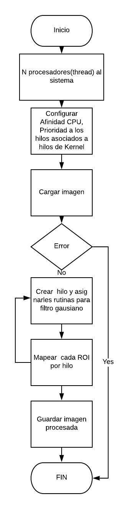

# Procesamiento-de-Imagen-optimizado-SO
## Sistemas Operativos

### Solución proyecto usando múltiples procesos y llamadas al sistema para aplicar el filtro gaussiano en el menor tiempo posible y aprovechando los recursos disponibles al máximo del computador 
etcruz@espol.edu.ec

Para solucionar el problemas de procesamiento digital de una imagen usando OPENCV se
preguntó al sistema operativo cuantos hilos o procesadores dispone por cada core, entonces se
configuro la afinidad del CPU con esta información, luego se procedió a declarar un arreglo
de hilos en conjunto con un arreglo de enteros para los respectivos Tid de cada hilo, usando
los atributos configurados por pthread_attr_init se logró llenar de características o atributos a
nuestros hilos.

Configuramos el alcance de contención del proceso de cada hilo como System Contention
Scope(SCS) para asegurar que nuestros hilos sean directamente conectados con los hilos del
kernel usando el modelo one-to-one, luego configuramos la prioridad de cada hilo sea -
20(alta) para cada hilo.

Para el proceso del filtro se crearon N hilos y se le asignaron rutinas , aquí es donde se hizo
efectiva la configuración de cada hilo con su respectiva CPU usando bucle for para asignarle
al Hilo i el CPU i. Ya en la rutina se procesaba regiones de la imagen en paralelo, es decir, en
base a la cantidad de hilos(N=4) se tomaban sectores (255x255) de la imagen de entrada de
512x512, completando así por 4 hilos ejecutándose paralelamente toda la imagen de
512x512.

Finalmente se recogió a cada hilo para posteriormente escribir la imagen con el filtro
gaussiano aplicado.

Diagrama adjunto:

    

